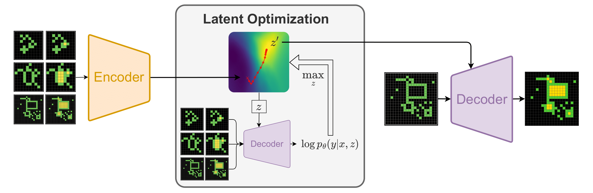

# Latent Program Network
Code for the paper _Searching Latent Program Spaces_, submitted to the [ARC Prize 2024](https://www.kaggle.com/competitions/arc-prize-2024) competition.

Authors and maintainers: [Clément Bonnet](https://github.com/clement-bonnet) & [Matthew V Macfarlane](https://github.com/mvmacfarlane).


## Links
- [📄 Paper on arXiv](https://arxiv.org/abs/2411.08706)
- [🚀 Interactive Demo](https://huggingface.co/spaces/clement-bonnet/lpn)


## Overview



## Installation
Install JAX using the official documentation [here](https://github.com/jax-ml/jax?tab=readme-ov-file#instructions). Then, install the required packages using the following commands:
```bash
git clone https://github.com/clement-bonnet/lpn
cd lpn
pip install -U -r requirements.txt
```


## Repository Structure
```
src/
├── configs/        # Configuration files (use with hydra)
├── datasets/       # Data processing utilities (re-arc)
├── models/         # Neural network architectures (lpn)
└── train.py        # Main training script
```


## Usage
To train a model, run the following command (replace the config name with the desired configuration):
```bash
python src/train.py --config-name debug
```


## License
This project is licensed under the open-source Apache 2.0 License. See the [LICENSE](LICENSE) file for more details.


## Citation
If you use this code in your research, please cite:
```bibtex
@misc{bonnet2024searchinglatentprogramspaces,
      title={Searching Latent Program Spaces}, 
      author={Clément Bonnet and Matthew V Macfarlane},
      year={2024},
      eprint={2411.08706},
      archivePrefix={arXiv},
      primaryClass={cs.LG},
      url={https://arxiv.org/abs/2411.08706}, 
}
```